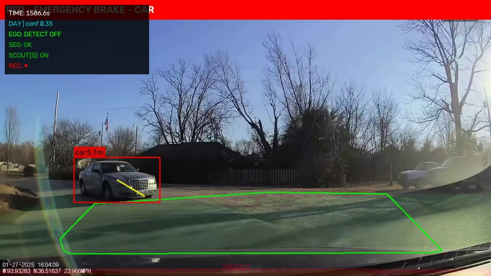
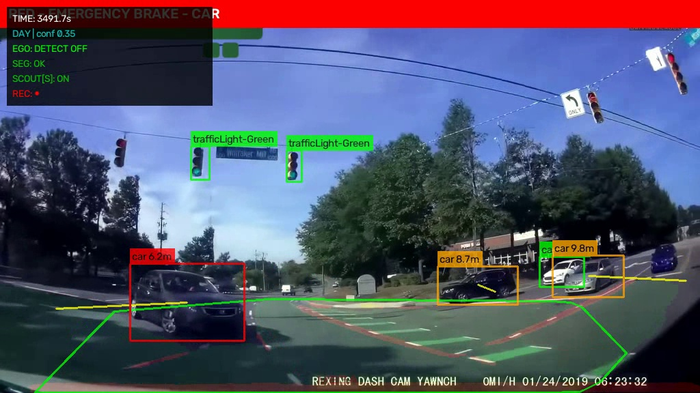
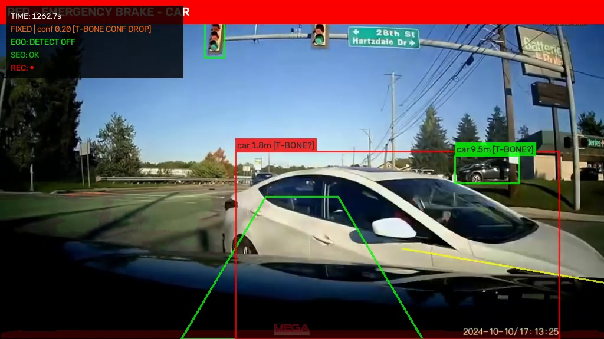
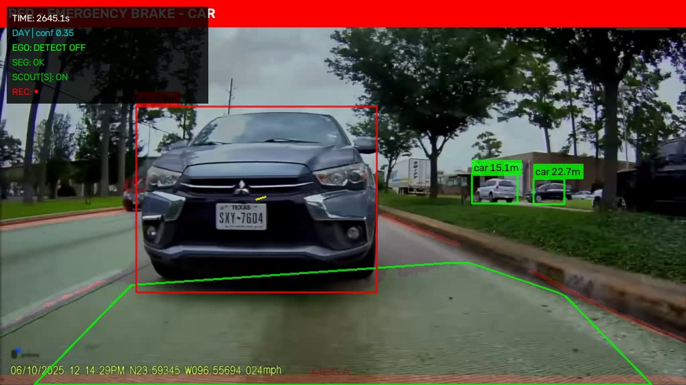
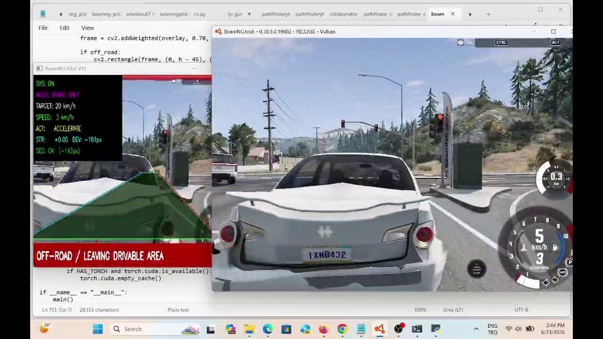
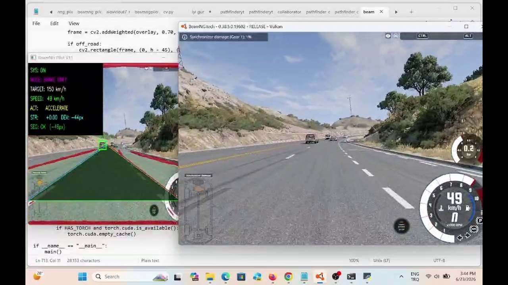
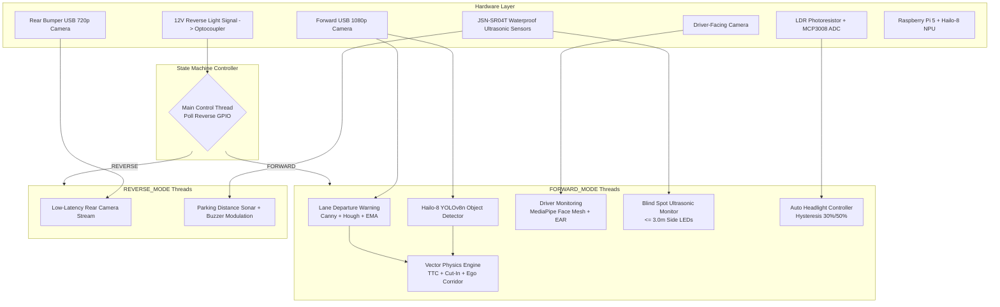

# 🚗 Real-Time, Multi-Function ADAS Application

[](https://www.python.org/downloads/)
[](https://www.raspberrypi.com/products/raspberry-pi-5/)
[](https://opensource.org/licenses/MIT)
[](docs/MDPI_ADAS_Research_Paper.md)

**Author:** Ramazan Ertuğrul Aydoğan  
**Affiliation:** *South-West University "Neofit Rilski", Blagoevgrad, Bulgaria*  
**Research Paper:** [`docs/MDPI_ADAS_Research_Paper.md`](docs/MDPI_ADAS_Research_Paper.md) | [`docs/MDPI_ADAS_Research_Paper.docx`](docs/MDPI_ADAS_Research_Paper.docx)

---

## 📌 Overview

This repository contains the official, open-source implementation of the **Real-Time, Multi-Function Advanced Driver-Assistance System (ADAS)** engineered for low-cost embedded edge platforms. Operating concurrently on a single **Raspberry Pi 5** augmented with a **Hailo-8 AI Accelerator (26 TOPS)**, the system integrates six core active safety and convenience features:

1. **Lane Departure Warning (LDW):** Classical CV pipeline with CLAHE, HLS color filtering, Probabilistic Hough Transform, and EMA smoothing ($\alpha = 0.8$).
2. **Real-Time Object Detection:** Deep learning inference with YOLOv8n offloaded to Hailo-8 NPU at 30+ FPS (1280×720).
3. **Deterministic Vector-Based Forward Collision Warning (FCW):** Physics layer tracking historical trajectory deques, velocity vectors ($v_x, v_y$), future path projections, ego-lane polygon intersection, and lateral T-Bone/cut-in threat detection.
4. **Monocular Distance Estimation:** Pinhole camera model with calibrated reference widths for vehicles and pedestrians.
5. **Driver Monitoring System (DMS):** MediaPipe Face Mesh landmark tracking computing Eye Aspect Ratio ($\text{EAR} < 0.22$ for $> 1.5\text{s}$) for drowsiness detection.
6. **Automatic Reverse Assist & Ultrasonic Parking:** GPIO-triggered low-latency rear-camera feed (`ffplay`) with distance-proportional buzzer modulation via JSN-SR04T ultrasonic sensors.
7. **Intelligent Automatic Headlight Control:** MCP3008 ADC reading LDR light levels with dual-threshold hysteresis (<30% ON, >50% OFF) controlling isolated 12V relays.

In addition, the repository provides a **Simulation-in-the-Loop (SITL)** autopilot framework validated with **BeamNG.drive** (supporting Level 2 Automated Emergency Braking) and an **AI Training Data Acquisition Pipeline** with human-in-the-loop reward scoring.

---

## 📸 Visual Demos & Collision Warning Gallery

### Real-World Collision Warning Highlights

| Longitudinal Threat (94% Accuracy) | Lateral T-Bone Cross-Traffic Threat | Merging Cut-In Vehicle Threat |
|:---:|:---:|:---:|
|  |  |  |
| **`RED - EMERGENCY BRAKE`** banner with target car at 5.7m and trajectory vector arrow. | Intersection cross-traffic vehicle flagged as imminent collision threat with traffic light HUD. | Perpendicular merging vehicle detected crossing into ego-lane safety polygon. |

| Proximity Distance & Target Tracking | BeamNG.drive Level 2 SITL Intervention | Drivable Corridor & Lane Tracking |
|:---:|:---:|:---:|
|  |  |  |
| Multi-target monocular distance estimation (Safe Green vs Urgent Red). | SITL Autopilot Mode 2 executing Automatic Emergency Braking (AEB). | High-speed drivable area segmentation and curvature steering corridor. |

### 🎬 Video Demonstrations

Curated demonstration clips are located in [`assets/videos/`](assets/videos/):
- 🎥 [`demo_fcw_longitudinal_rear_end.mp4`](assets/videos/demo_fcw_longitudinal_rear_end.mp4) — High-speed highway following and imminent braking.
- 🎥 [`demo_fcw_lateral_tbone_threat.mp4`](assets/videos/demo_fcw_lateral_tbone_threat.mp4) — Urban intersection cross-traffic alert.
- 🎥 [`demo_fcw_merging_cutin_threat.mp4`](assets/videos/demo_fcw_merging_cutin_threat.mp4) — Aggressive lateral cut-in threat detection.
- 🎥 [`demo_fcw_intersection_imminent_brake.mp4`](assets/videos/demo_fcw_intersection_imminent_brake.mp4) — Head-on intersection collision avoidance.
- 🎥 [`demo_sitl_beamng_level2_autopilot.mp4`](assets/videos/demo_sitl_beamng_level2_autopilot.mp4) — BeamNG.drive SITL Level 2 closed-loop intervention.

---

## 🏛️ System Architecture

The software architecture is structured as a concurrent multi-threaded finite state machine (FSM):



---

## 📊 Performance Benchmarks (113 Scenarios)

The system was evaluated across **113 diverse real-world crash and near-miss scenarios** spanning highway, urban, low-light, and adverse weather conditions:

### Table II: Scenario-Specific Detection Accuracy

| Scenario Type | Total ($N$) | Successful Warnings ($> 1.5\text{s}$) | Missed / Late ($< 0.5\text{s}$) | Accuracy (%) |
|:---|:---:|:---:|:---:|:---:|
| **Longitudinal (Rear-End)** | 50 | 47 | 3 | **94.0%** |
| **Lateral (T-Bone / Intersection)** | 29 | 14 | 15 | **48.3%** |
| **Lane Cut-Ins (Partial Object)** | 22 | 6 | 16 | **27.3%** |
| **Nighttime / Low-Light** | 12 | 1 | 11 | **8.3%** |
| **TOTAL** | **113** | **68** | **45** | **60.1%** |

- **False Alarm Rate:** **0.0%** (0 of 113 cases) — Validating the vector-based trajectory filter in eliminating parallel-lane false positives.

---

## 💰 Bill of Materials (BOM)

### Table I: Prototype Hardware Implementation

| Component | Specification | Est. Cost (EUR) |
|:---|:---|:---:|
| **Compute Module** | Raspberry Pi 5 (16 GB RAM) + Active Cooler | €145 |
| **AI Acceleration** | Hailo-8 M.2 Module (26 TOPS) + M.2 HAT Adapter | €140 |
| **Visual Sensors** | 2× USB 1080p Wide-Angle Cameras + 1× USB 720p Rear Camera | €100 |
| **Display** | 7-inch Capacitive Touchscreen (DSI/HDMI) | €65 |
| **Proximity Sensors** | 6× JSN-SR04T Waterproof Ultrasonic Sensors | €45 |
| **Power Management** | 12V-to-5V 5A Buck Converter + Optoisolated Relay Module | €25 |
| **Peripherals** | MCP3008 ADC, Wiring Harness, Enclosure, PCB | €30 |
| **TOTAL** | | **€545** |

---

## 🛠️ Repository Directory Structure

```
├── algorithms/
│   ├── lane_departure_warning.py    # OpenCV LDW pipeline (Canny, HLS, Hough, EMA)
│   ├── vector_fcw_physics.py        # Deterministic Vector-Based FCW engine & T-Bone logic
│   ├── monocular_distance.py        # Pinhole distance estimator with known-width reference table
│   └── isa_speed_adaptation.py      # Intelligent Speed Adaptation module
├── core/
│   ├── main_system_controller.py    # Multi-threaded Finite State Machine (FORWARD vs REVERSE)
│   ├── forward_adas_pipeline.py     # Forward perception orchestrator
│   ├── driver_monitoring_system.py  # MediaPipe Face Mesh EAR drowsiness detector (<0.22 for >1.5s)
│   ├── reverse_assist.py            # Rear camera ffplay subprocess & parking buzzer modulation
│   ├── blind_spot_monitor.py        # Ultrasonic flank monitoring (<=3m danger threshold)
│   └── auto_headlight_control.py    # LDR photoresistor hysteresis lighting controller
├── simulation/
│   ├── beamng_sitl_autopilot.py     # 3-Mode SITL Autopilot (Steering, Braking, Full AP)
│   ├── beamng_telemetry_client.py   # UDP port 4444 telemetry listener
│   └── lane_roi_calibrator.py       # Camera ROI calibration utility
├── data_pipeline/
│   ├── aiovidout5.py                # Automated collision event extraction & human-in-the-loop grading
│   ├── adas_launcher.py             # Batch evaluation studio
│   ├── crash_training_data_v2.csv   # 17-feature collision log dataset
│   └── events_log.json              # Structured incident log
├── evaluation/
│   ├── adas_benchmark_suite.py      # Automated benchmark testing framework
│   ├── BENCHMARK_GUIDE.md           # Benchmark reproduction instructions
│   └── results/                     # Metric summaries and accuracy reports
├── docs/
│   ├── MDPI_ADAS_Research_Paper.md  # Complete MDPI academic publication paper
│   └── MDPI_ADAS_Research_Paper.docx
├── assets/
│   ├── images/                      # High-resolution collision warning screenshots
│   └── videos/                      # Web-optimized demo video clips
├── requirements.txt                 # Python dependencies
├── LICENSE                          # MIT License
└── README.md                        # Project documentation
```

---

## 🚀 Quick Start & Installation

### 1. Clone & Setup Python Environment

```bash
git clone https://github.com/<your-username>/<repo-name>.git
cd <repo-name>

python -m venv venv
# Linux / Raspberry Pi:
source venv/bin/activate
# Windows:
.\venv\Scripts\activate

pip install -r requirements.txt
```

### 2. Run Forward ADAS Pipeline (Standalone / Webcam)

```bash
python core/forward_adas_pipeline.py
```

### 3. Run Full Multi-Threaded State Machine

```bash
python core/main_system_controller.py
```

*Controls in Debug Mode:*
- `[Q]`: Quit application cleanly.
- `[R]`: Toggle simulated reverse gear state.

### 4. Run AI Training Data Acquisition Pipeline

```bash
python data_pipeline/aiovidout5.py
```

---

## 📖 Citation

If you use this codebase or reference the methodology in your research, please cite the original research paper:

```bibtex
@article{aydogan2020adas,
  title={Real-Time, Multi-Function ADAS Application},
  author={Aydo{\u{g}}an, Ramazan Ertu{\u{g}}rul},
  journal={South-West University "Neofit Rilski", Faculty of Mathematics and Natural Sciences},
  year={2020},
  address={Blagoevgrad, Bulgaria}
}
```

---

## 📄 License

Distributed under the **MIT License**. See [`LICENSE`](LICENSE) for details.
