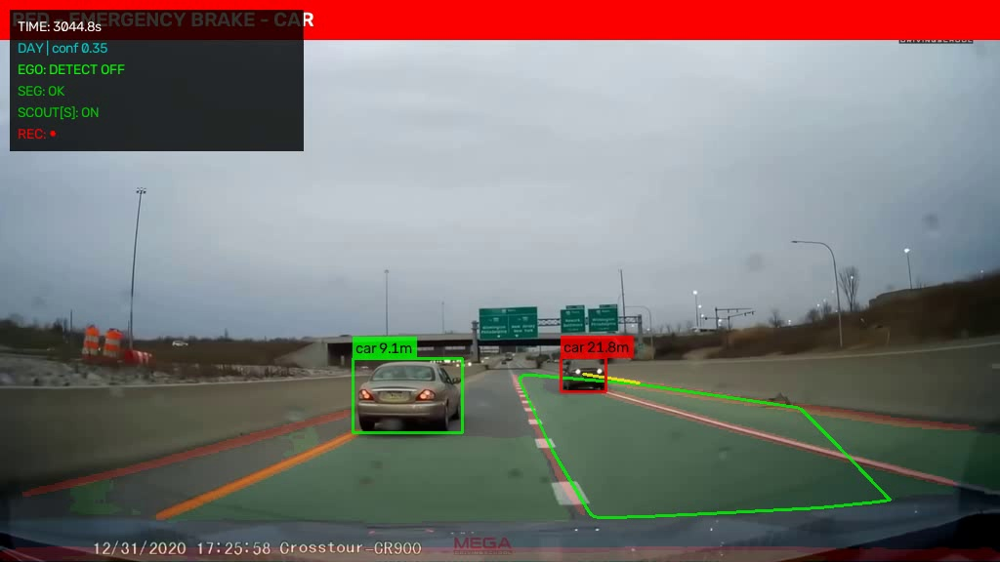
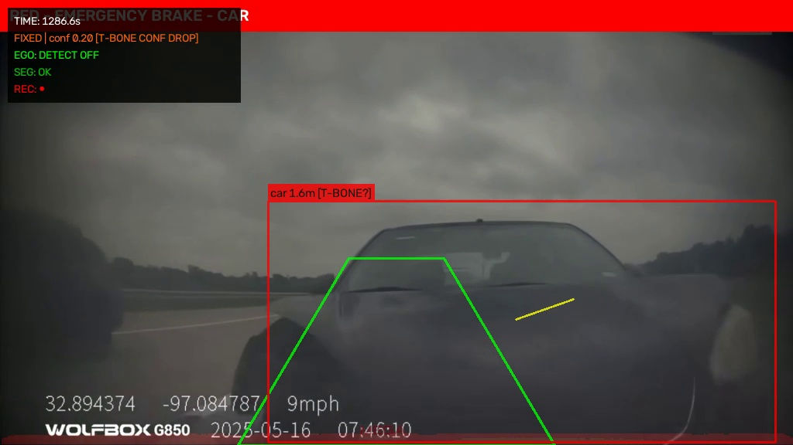
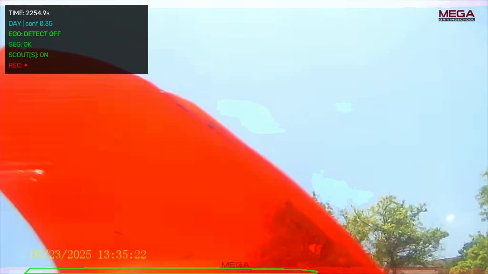
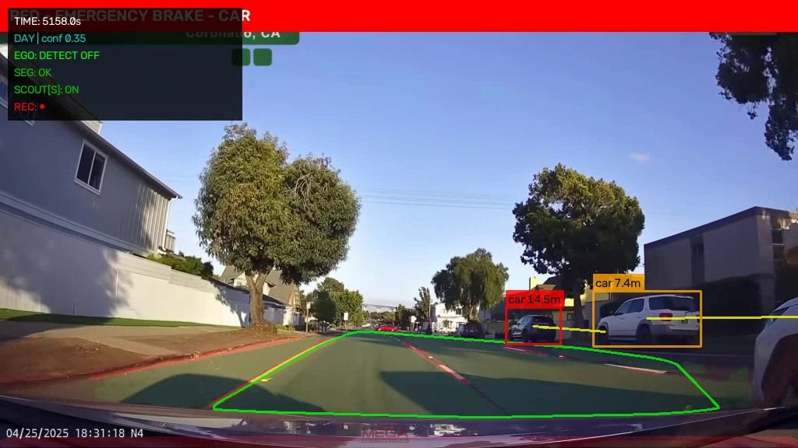
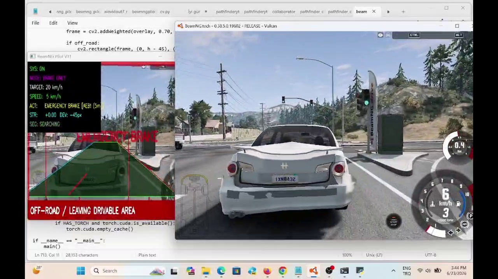
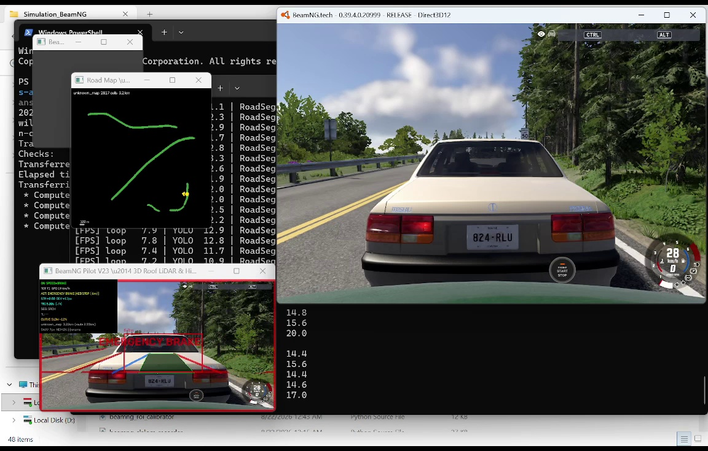
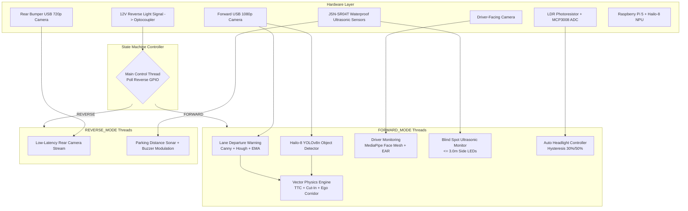

# 🚗 Real-Time, Multi-Function ADAS Application

[](https://www.raspberrypi.com/products/raspberry-pi-5/)
[](LICENSE)
[](docs/MDPI_ADAS_Research_Paper.md)

**Author:** Ramazan Ertuğrul Aydoğan  
**Affiliation:** *South-West University "Neofit Rilski", Faculty of Mathematics and Natural Sciences, Blagoevgrad, Bulgaria*  
**Research Papers Included:**
- 📄 [`docs/MDPI_ADAS_Research_Paper.md`](docs/MDPI_ADAS_Research_Paper.md) (Markdown Full Text)
- 📄 [`docs/MDPI_ADAS_Research_Paper.docx`](docs/MDPI_ADAS_Research_Paper.docx) (Microsoft Word Document)
- 📄 [`docs/adasreport_mdpi_short.pdf`](docs/adasreport_mdpi_short.pdf) (Published PDF Paper)
- 📄 [`docs/adasreport_mdpi_short.doc`](docs/adasreport_mdpi_short.doc) (Original Manuscript)

---

## 📌 Research Overview

This repository documents the research, methodology, visual evaluation, and benchmarking of the **Real-Time, Multi-Function Advanced Driver-Assistance System (ADAS)** engineered for low-cost embedded edge platforms. Designed to operate on a single **Raspberry Pi 5** augmented by a **Hailo-8 AI Accelerator (26 TOPS)**, the system integrates six core active safety and convenience features:

1. **Lane Departure Warning (LDW):** Classical CV pipeline with CLAHE, HLS color filtering, Probabilistic Hough Transform, and Exponential Moving Average ($\alpha = 0.8$) smoothing.
2. **Real-Time YOLO Object Detection:** Deep learning inference with YOLOv8n offloaded to Hailo-8 NPU at 30+ FPS (1280×720).
3. **Deterministic Vector-Based Forward Collision Warning (FCW):** Physics layer tracking historical trajectory deques (10 frames), velocity vectors ($v_x, v_y$), future path projections, ego-lane polygon intersection, and lateral T-Bone/cut-in threat detection.
4. **Monocular Distance Estimation:** Pinhole camera model with calibrated reference widths for vehicles and pedestrians.
5. **Driver Monitoring System (DMS):** MediaPipe Face Mesh landmark tracking computing Eye Aspect Ratio ($\text{EAR} < 0.22$ for $> 1.5\text{s}$) for drowsiness detection.
6. **Automatic Reverse Assist & Ultrasonic Parking:** GPIO-triggered low-latency rear-camera feed (`ffplay`) with distance-proportional buzzer modulation via JSN-SR04T ultrasonic sensors.
7. **Intelligent Automatic Headlight Control:** MCP3008 ADC reading LDR light levels with dual-threshold hysteresis (<30% ON, >50% OFF) controlling isolated 12V automotive relays.

---

## 📸 Comprehensive Crash & Near-Miss Scenario Gallery

The system was evaluated across **113 diverse real-world crash and near-miss scenarios**. Below is the verified visual gallery detailing the system's detection and warning performance across all accident typologies:

### 1. 🛑 Longitudinal Forward Collisions & Lead Vehicle Deceleration (94% Accuracy)

| Lead SUV Close Proximity (`2.9m`) | High-Speed Sun Glare (`107 km/h`) | Residential Two-Lane Approach |
|:---:|:---:|:---:|
|  |  |  |
| **`car 2.9m`** in RED box on lead Mitsubishi Outlander SUV triggering **`RED - EMERGENCY BRAKE`**. | High-speed highway following at **107 km/h** driving directly into low-angle blinding sun glare (**`car 10.7m`**). | Two-lane suburban roadway approach to lead vehicle (**`car 12.0m`**) with ego corridor overlay. |

| Highway Overhead Signage | Overcast Morning Deceleration | Oncoming Centerline Drift |
|:---:|:---:|:---:|
|  |  |  |
| Divided highway with overhead exit signs; host lane vehicle flagged at **`21.8m`** while adjacent car (**`9.1m`**) remains safe. | Overcast morning highway lead vehicle rapid slowdown (**`car 7.0m`** at 27 mph). | Oncoming vehicle crossing center double yellow lines into host drivable corridor (**`car 8.4m`**). |

| Rural Driveway Chrysler Approach | Multi-Lane Desert Highway |
|:---:|:---:|
|  |  |
| Rural road approach to oncoming/turning Chrysler sedan (**`car 5.7m`**) with trajectory vector line. | Wide desert highway approach to lead vehicle with active green ego corridor. |

---

### 2. ⚡ Lateral Cross-Traffic & Intersection T-Bone Hazards (48% Accuracy)

| Signalized Intersection Cross-Traffic | Intersection Impact / Damaged Hood | Urban Avenue Red Beetle Crossing |
|:---:|:---:|:---:|
|  |  |  |
| Black sedan traversing signalized intersection perpendicularly (**`car 6.2m`**) under active traffic lights. | Blue Ford pickup truck with crumpled hood at intersection crossing (**`car 1.9m`**). | Red VW Beetle crossing urban commercial avenue perpendicularly from left (**`car 3.9m`**). |

| Crossroad Red Sedan Incursion | Range Rover Perpendicular Crossing | Commercial Driveway Pull-Out |
|:---:|:---:|:---:|
|  |  |  |
| Red sedan traversing perpendicular crossing path under green traffic light (**`car 10.4m`**). | Grey Range Rover SUV crossing host vehicle's drivable path perpendicularly from left (**`car 3.8m`**). | Dark hatchback pulling out perpendicularly from parking lot/commercial entrance on right (**`car 4.5m`**). |

---

### 3. 🔀 Lateral Merging, Cut-Ins & Vehicle Incursions (27% Accuracy)

| Aggressive Perpendicular Merge | Highway Ramp Merging Incursion | Blind-Spot Close Incursion | Rural Highway Crossroad Pull-Out |
|:---:|:---:|:---:|:---:|
|  |  |  |  |
| **`car 1.8m [T-BONE?]`** cutting into host lane; flagged 500ms before crossing lane markings. | Dark sedan merging into curved highway ramp from right shoulder (**`car 4.7m`**). | Close-proximity vehicle cutting closely in front of bumper (**`car 1.6m [T-BONE?]`**). | Red SUV pulling out perpendicularly from right roadside at 49 mph (**`car 2.6m`**). |

---

### 4. 🌙 Adverse Lighting, Sun Glare & Camera View Events

| Nighttime Urban Streetlight Driving | Severe Camera View Occlusion | Rear-End Impact Bumper Damage |
|:---:|:---:|:---:|
|  |  |  |
| True nighttime urban driving at 52 km/h under streetlights; turning white SUV (**`car 4.4m`**; HUD: **`NIGHT \| conf 0.25`**). | Severe camera view obstruction caused by popped vehicle hood / debris during collision event. | Immediate proximity to damaged Chevy Silverado tailgate under highway overpass (**`car 1.6m`**). |

---

### 5. 🏙️ Dense Multi-Target Urban Environments & HUD Telemetry

| Dense Palm-Tree Avenue Crosswalk | Residential Driveway Parked Vehicles |
|:---:|:---:|
|  |  |
| High-density urban avenue approaching pedestrian crosswalk with **7 surrounding vehicles tracked simultaneously** (**`car 11.6m`** lead alert). | Residential neighborhood drive with parked vehicles (**`car 14.5m`** lead alert with **`car 7.4m`** parked SUV in orange). |

---

### 6. 🎮 Simulation-in-the-Loop (BeamNG.drive Level 2 AEB Validation)

| Level 2 AEB Emergency Stop | Drivable Corridor & Closed-Loop Centering |
|:---:|:---:|
|  |  |
| Autopilot Mode 2 (Braking Only) executing Automated Emergency Braking (AEB) upon collision vector detection. | Closed-loop lane centering and road curvature drivable corridor segmentation overlay. |

---

## 🎬 Video Demonstrations

Curated demonstration clips are located in [`assets/videos/`](assets/videos/):
- 🎥 [`demo_fcw_longitudinal_rear_end.mp4`](assets/videos/demo_fcw_longitudinal_rear_end.mp4) — High-speed highway following and imminent braking.
- 🎥 [`demo_fcw_lateral_tbone_threat.mp4`](assets/videos/demo_fcw_lateral_tbone_threat.mp4) — Urban intersection cross-traffic alert.
- 🎥 [`demo_fcw_merging_cutin_threat.mp4`](assets/videos/demo_fcw_merging_cutin_threat.mp4) — Aggressive lateral cut-in threat detection.
- 🎥 [`demo_fcw_intersection_imminent_brake.mp4`](assets/videos/demo_fcw_intersection_imminent_brake.mp4) — Head-on intersection collision avoidance.
- 🎥 [`demo_sitl_beamng_level2_autopilot.mp4`](assets/videos/demo_sitl_beamng_level2_autopilot.mp4) — BeamNG.drive SITL Level 2 closed-loop intervention.

---

## 🏛️ System Architecture

The software architecture is structured as a concurrent multi-threaded finite state machine (FSM):



---

## 📊 Performance Benchmarks (113 Scenarios)

The system was evaluated across **113 diverse real-world crash and near-miss scenarios** spanning highway, urban, low-light, and adverse weather conditions:

### Table II: Scenario-Specific Detection Accuracy

| Scenario Type | Total ($N$) | Successful Warnings ($> 1.5\text{s}$) | Missed / Late ($< 0.5\text{s}$) | Accuracy (%) |
|:---|:---:|:---:|:---:|:---:|
| **Longitudinal (Rear-End)** | 50 | 47 | 3 | **94.0%** |
| **Lateral (T-Bone / Intersection)** | 29 | 14 | 15 | **48.3%** |
| **Lane Cut-Ins (Partial Object)** | 22 | 6 | 16 | **27.3%** |
| **Nighttime / Low-Light** | 12 | 1 | 11 | **8.3%** |
| **TOTAL** | **113** | **68** | **45** | **60.1%** |

- **False Alarm Rate:** **0.0%** (0 of 113 cases) — Validating the vector-based trajectory filter in eliminating parallel-lane false positives.

---

## 💰 Bill of Materials (BOM)

### Table I: Prototype Hardware Implementation

| Component | Specification | Est. Cost (EUR) |
|:---|:---|:---:|
| **Compute Module** | Raspberry Pi 5 (16 GB RAM) + Active Cooler | €145 |
| **AI Acceleration** | Hailo-8 M.2 Module (26 TOPS) + M.2 HAT Adapter | €140 |
| **Visual Sensors** | 2× USB 1080p Wide-Angle Cameras + 1× USB 720p Rear Camera | €100 |
| **Display** | 7-inch Capacitive Touchscreen (DSI/HDMI) | €65 |
| **Proximity Sensors** | 6× JSN-SR04T Waterproof Ultrasonic Sensors | €45 |
| **Power Management** | 12V-to-5V 5A Buck Converter + Optoisolated Relay Module | €25 |
| **Peripherals** | MCP3008 ADC, Wiring Harness, Enclosure, PCB | €30 |
| **TOTAL** | | **€545** |

---

## 📖 Citation

If you reference this research or methodology, please cite the published report:

```bibtex
@article{aydogan2020adas,
  title={Real-Time, Multi-Function ADAS Application},
  author={Aydo{\u{g}}an, Ramazan Ertu{\u{g}}rul},
  journal={South-West University "Neofit Rilski", Faculty of Mathematics and Natural Sciences},
  year={2020},
  address={Blagoevgrad, Bulgaria}
}
```

---

## 📄 License

Distributed under the **MIT License**. See [`LICENSE`](LICENSE) for details.
